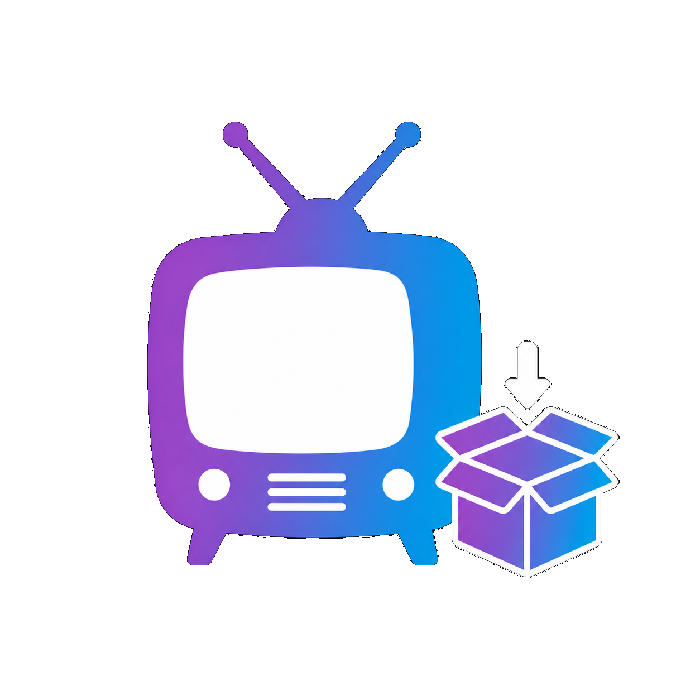

<p align="center"></p>
<h1 align="center">Media Collection Manager</h1>
<p align="center"><strong>⚠️ Early testing build:</strong> built for Jellyfin 10.11.11. Install only on a private test server and keep normal server backups.</p>
<p align="center">A companion to <a href="https://github.com/mp3li/Media-Tagging-Manager-Jellyfin-Plugin">Media Tagging Manager</a> for turning the metadata already in your Jellyfin libraries into normal Jellyfin collections.</p>

## What it does

Media Collection Manager reads existing Jellyfin and local-NFO metadata only. It does not download metadata, write tags, change NFO files, rename media, or access streaming services.

Media Tagging Manager can assign useful metadata such as Provider, Network, Genre, Keyword, Collection, cast, crew, production, rating, and language information. This plugin can use that information alongside every other metadata value already in your library.

## Current testing workflow

1. **Main Settings** — choose libraries, save settings, scan a local metadata catalog, and inspect the paginated per-library overview.
2. **Individual Tag Collections** — select metadata values and create one reviewed native Jellyfin collection per value.
3. **Combined Tag Collections** — select multiple values and create one collection containing the unique media matching any selected value.
4. **Multi-Match Tag Collections** — select multiple values and create one collection containing only media matching every selected value.

Every draft supports previews, selected additional libraries, editable titles, and an explicit choice when a native Jellyfin collection with the same title already exists.

## Requirements

- Jellyfin Server **10.11.11**
- Administrator access
- Existing local library metadata

The project builds against Jellyfin.Controller and Jellyfin.Model 10.11.11.

## Private testing

Build the DLL:

```bash
dotnet build "Media Collection Manager/MediaCollectionManager.csproj" --configuration Release
```

Install the resulting DLL privately, restart Jellyfin, then open **Dashboard → Media Collection Manager**. Record observed results in [Documentation/goal-testing.txt](Documentation/goal-testing.txt).

## Project documents

- [Product goals](Documentation/project-goals.txt)
- [Testing tracker](Documentation/goal-testing.txt)
- [Changelog](Documentation/CHANGELOG.md)

## License

Media Collection Manager is available under the [Media Collection Manager
Noncommercial License 1.0](LICENSE).
